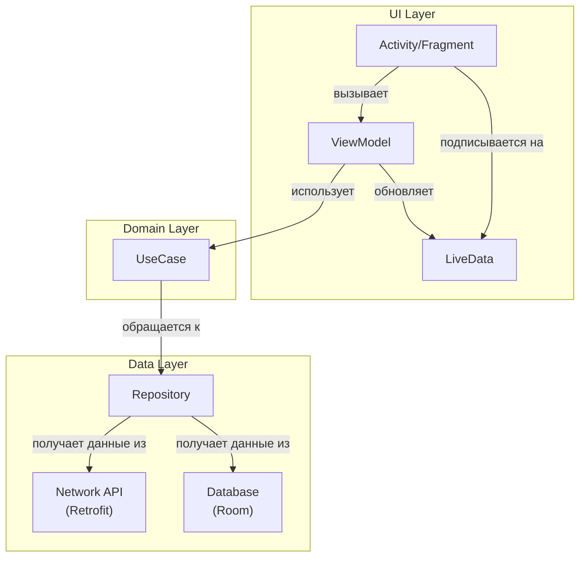
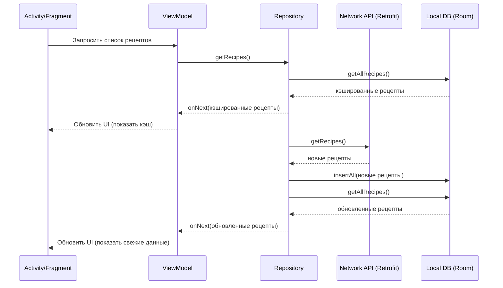

[**Главная**](./README.md) | [**Введение**](./01_introduction.md) | [**API**](./04_backend_api.md) | [**База данных**](./05_database.md) | [**Функции**](./06_features.md)
***
# Архитектура

Приложение "Cooking App" построено с использованием современных практик разработки под Android и следует архитектуре, близкой к Clean Architecture, с четким разделением слоев. Основным архитектурным паттерном является **MVVM (Model-View-ViewModel)**.

## Обзор слоев

Приложение разделено на несколько основных слоев (пакетов), каждый из которых имеет свою зону ответственности:

-   `data`: Слой данных, который отвечает за предоставление данных приложению. Он включает в себя репозитории, которые абстрагируют источники данных (сеть, база данных).
-   `domain`: Слой домена (или бизнес-логики). Он содержит бизнес-правила и варианты использования (use cases), которые orchestrate поток данных из слоя `data` в `ui`.
-   `network`: Отвечает за всю сетевую коммуникацию. Здесь находятся Retrofit сервисы, DTO (Data Transfer Objects) и конфигурация сетевых запросов.
-   `ui`: Слой представления. Он включает в себя Activities, Fragments и ViewModels. View отвечает за отображение данных, а ViewModel - за подготовку и управление данными для View.
-   `auth`: Содержит логику, связанную с аутентификацией пользователя.
-   `model`: Содержит модели данных, используемые в приложении.

## Паттерн MVVM

-   **Model**: Представляет данные и бизнес-логику. В нашем приложении это слой `data` и `domain`.
-   **View**: Пользовательский интерфейс (Activities, Fragments). Он "подписывается" на изменения в ViewModel через LiveData и обновляет UI.
-   **ViewModel**: Посредник между View и Model. Он обрабатывает логику UI, вызывает необходимые use cases и предоставляет данные для View через LiveData.

## Поток данных

1.  **View** (например, `RecipeDetailActivity`) инициирует действие (например, запрос на загрузку рецепта).
2.  **View** вызывает метод в своей **ViewModel**.
3.  **ViewModel** вызывает соответствующий **Use Case** из слоя `domain`.
4.  **Use Case** обращается к **Repository** из слоя `data` для получения данных.
5.  **Repository** определяет, откуда брать данные - из локальной базы данных (Room) или из сети (Retrofit).
6.  Данные возвращаются обратно по цепочке: `Repository` -> `Use Case` -> `ViewModel`.
7.  **ViewModel** обновляет `LiveData`, на которую подписана **View**.
8.  **View** получает обновленные данные и отображает их пользователю.

## Диаграмма архитектуры

### Диаграмма последовательности: Загрузка рецептов

Эта диаграмма иллюстрирует взаимодействие компонентов при запросе списка рецептов.

***
[**⬆ К оглавлению**](./README.md) 
