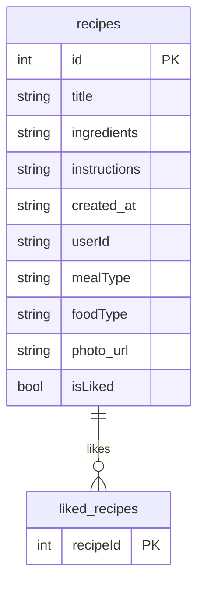

[**Главная**](./README.md) | [**Введение**](./01_introduction.md) | [**Архитектура**](./03_architecture.md) | [**API**](./04_backend_api.md) | [**Функции**](./06_features.md)
***
# Локальная база данных

Приложение использует библиотеку **Room** для создания и управления локальной базой данных SQLite. Это обеспечивает кэширование данных и возможность работы в автономном режиме.

## Обзор

-   **Имя базы данных**: `recipes_database`
-   **Версия**: 5
-   **Стратегия миграции**: `fallbackToDestructiveMigration` (При обновлении схемы старая база данных удаляется).
-   **Основной класс**: `AppDatabase.java`

## Таблицы (Entities)

### 1. `recipes`

Хранит полную информацию о рецептах.

-   **Класс**: `RecipeEntity.java`
-   **Поля**:
    -   `id` (INTEGER, Primary Key): Уникальный идентификатор рецепта.
    -   `title` (TEXT): Название рецепта.
    -   `ingredients` (TEXT): Список ингредиентов (сериализованный в JSON).
    -   `instructions` (TEXT): Список шагов приготовления (сериализованный в JSON).
    -   `created_at` (TEXT): Дата создания.
    -   `userId` (TEXT): Идентификатор пользователя, создавшего рецепт.
    -   `mealType` (TEXT): Тип блюда (например, "Завтрак").
    -   `foodType` (TEXT): Тип кухни (например, "Итальянская").
    -   `photo_url` (TEXT): URL фотографии рецепта.
    -   `isLiked` (INTEGER/BOOLEAN): Флаг, указывающий, лайкнул ли текущий пользователь этот рецепт.

### 2. `liked_recipes`

Хранит информацию о том, какие рецепты были лайкнуты текущим пользователем.

-   **Класс**: `LikedRecipeEntity.java`
-   **Поля**:
    -   `recipeId` (INTEGER, Primary Key): Идентификатор лайкнутого рецепта. Является внешним ключом к `recipes.id`.

## Объекты доступа к данным (DAO)

-   `RecipeDao.java`: Предоставляет методы для выполнения CRUD-операций (создание, чтение, обновление, удаление) с таблицей `recipes`.
-   `LikedRecipeDao.java`: Предоставляет методы для добавления и удаления записей из таблицы `liked_recipes`.

## ER-диаграмма

Диаграмма показывает связь между таблицами `recipes` и `liked_recipes`.

***
[**⬆ К оглавлению**](./README.md) 