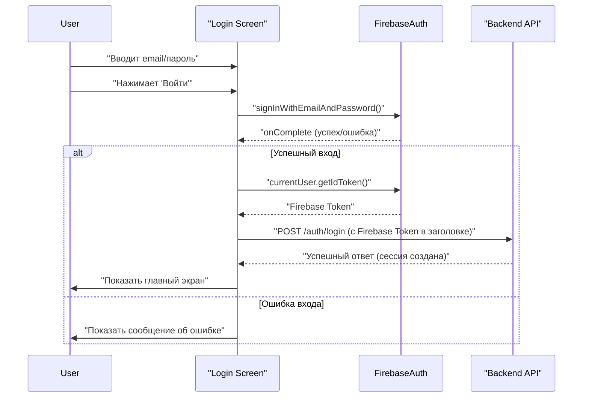

[**Главная**](./README.md) | [**Введение**](./01_introduction.md) | [**Архитектура**](./03_architecture.md) | [**API**](./04_backend_api.md) | [**База данных**](./05_database.md)
***
# Основные функции

В этом разделе подробно описаны ключевые возможности приложения "Cooking App".

## 1. Аутентификация пользователей

Приложение предоставляет надежную систему аутентификации с использованием **Firebase Authentication**.

-   **Регистрация и вход**: Пользователи могут создать аккаунт с помощью электронной почты и пароля или войти через свой Google-аккаунт.
-   **Управление сессиями**: После входа токен пользователя кэшируется, обеспечивая автоматический вход при последующих запусках.
-   **Восстановление пароля**: Реализована функция восстановления доступа к аккаунту по электронной почте.
-   **Безопасность**: Для защиты запросов к API используется `AuthInterceptor`, который автоматически добавляет токен аутентификации в заголовки всех исходящих запросов.

### Диаграмма последовательности: Вход пользователя

## 2. Управление рецептами

Основная функциональность приложения сосредоточена вокруг создания, просмотра и управления кулинарными рецептами.

-   **Просмотр и поиск**:
    -   Главный экран отображает список всех доступных рецептов.
    -   Пользователи могут использовать поисковую строку для простого или расширенного поиска рецептов по названию или ключевым словам.
-   **CRUD-операции**:
    -   **Создание**: Авторизованные пользователи могут добавлять новые рецепты, указывая название, ингредиенты, шаги приготовления и прикрепляя фотографию.
    -   **Чтение**: Полная информация о рецепте, включая детали приготовления и изображение, доступна на экране деталей.
    -   **Обновление**: Пользователи могут редактировать свои собственные рецепты.
    -   **Удаление**: Пользователи могут удалять рецепты, которые они создали.
-   **Лайки**: Пользователи могут ставить "лайки" понравившимся рецептам. Эта информация сохраняется как на сервере, так и локально.

## 3. AI-ассистент (Чат)

Инновационная функция приложения — это чат с искусственным интеллектом, который может помочь пользователям в процессе приготовления пищи.

-   **Взаимодействие в реальном времени**: Чат работает с использованием технологии **Socket.IO**, что обеспечивает мгновенный обмен сообщениями.
-   **Функционал**:
    -   **Начало диалога**: Пользователь может инициировать новую сессию с чат-ботом.
    -   **Обмен сообщениями**: Пользователи могут задавать вопросы (например, "Чем заменить ингредиент X?") и получать полезные советы.
    -   **История чата**: Приложение сохраняет историю переписки с AI-ассистентом в рамках текущей сессии.

## 4. Работа в офлайн-режиме

-   **Кэширование данных**: Приложение использует базу данных Room для кэширования рецептов. Это позволяет пользователям просматривать ранее загруженные рецепты даже без подключения к интернету.
-   **Фоновая синхронизация**: `WorkManager` может быть использован для синхронизации данных в фоновом режиме, когда соединение с сетью восстанавливается.

***
[**⬆ К оглавлению**](./README.md) 